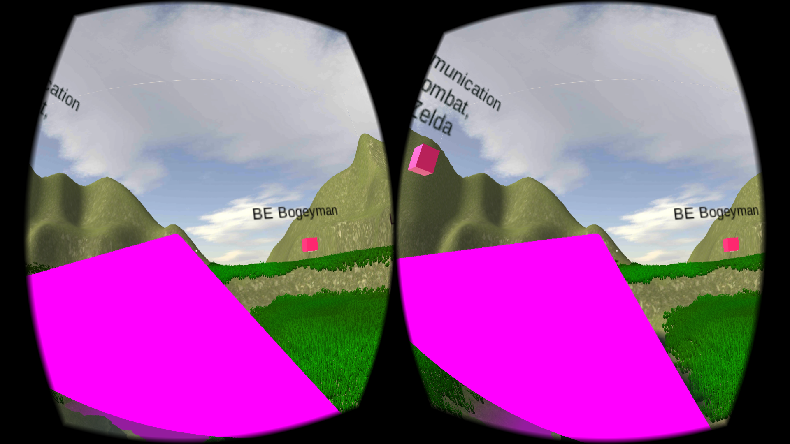

#VR Game for SM miniproject

Find the final APK for Android in the Builds/ folder. Install on an android device and use a Google Cardboard to play.
Download the APK here : https://github.com/virresh/SM-VR-Game/blob/master/Builds/finalGame.apk?raw=true

Game Built on Unity5

Blog Link - http://smwiki2016.wikidot.com/wiki:3d-game-development-using-unity

Screenshots running on Android Lollipop :

 

 
